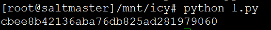
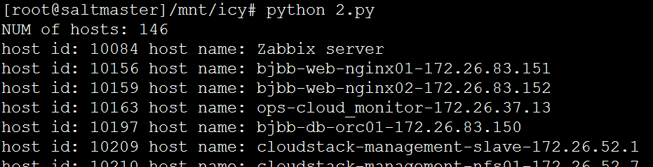
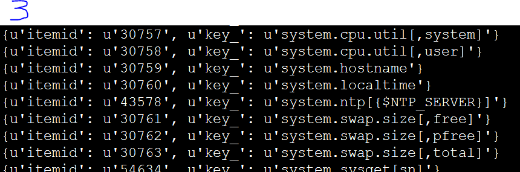
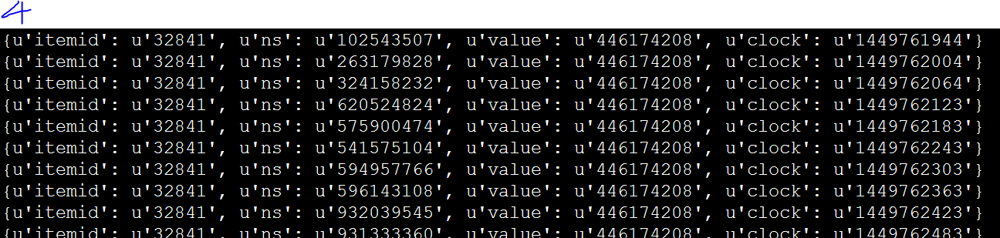

需求：调用zabbix的api接口，获取所有监控主机的cpu负载、内存、磁盘使用情况，将采集的数据存入数据库，
	  最后并使用django框架，进行前端展示。

zabbix  API官方文档：https://www.zabbix.com/documentation/3.0/manual/api/reference/history/get

1、生成authID

2、获得hostID+主机名

3、由hostID去得到所有的监控项，即itemID

4、由itemID获取监控的历史数据。

